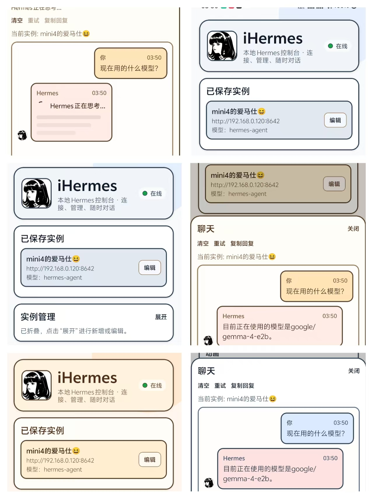
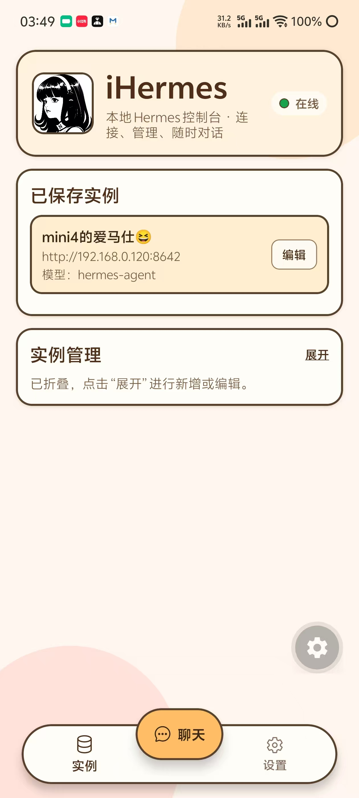
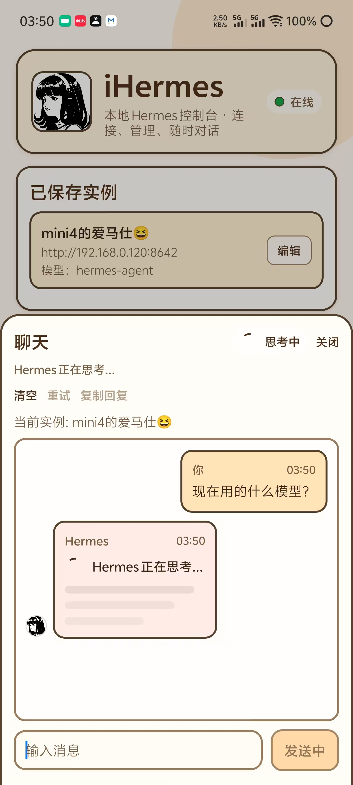
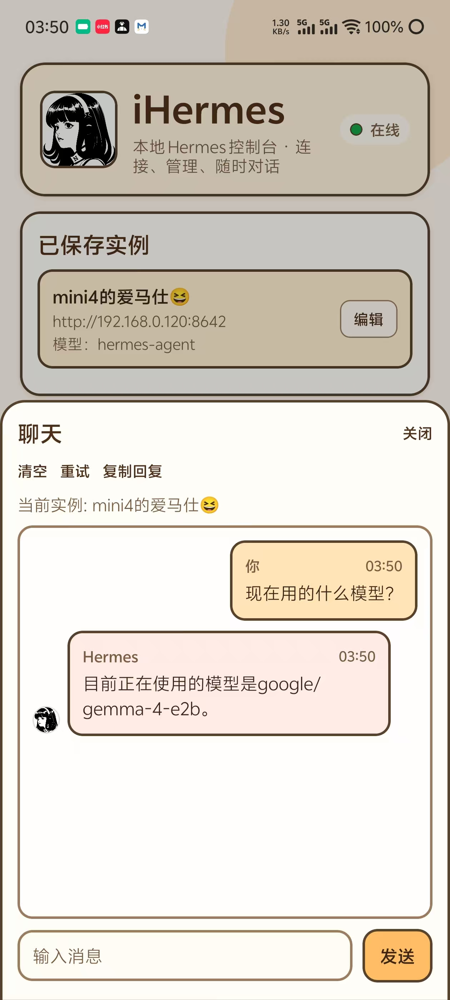
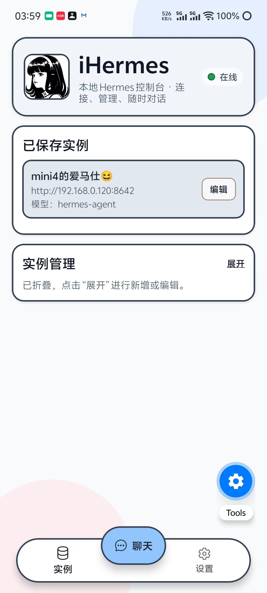
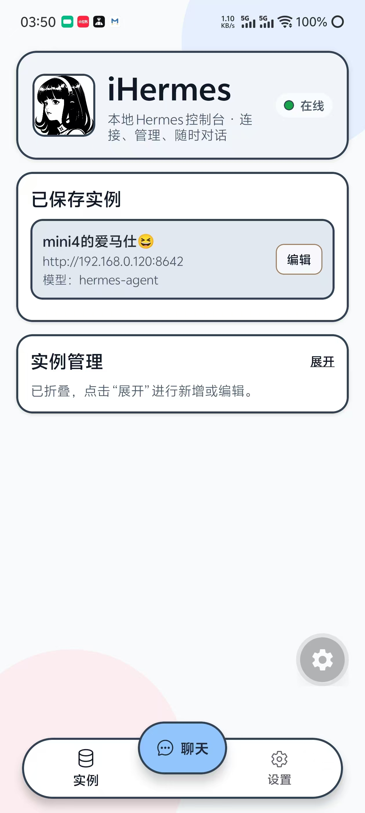
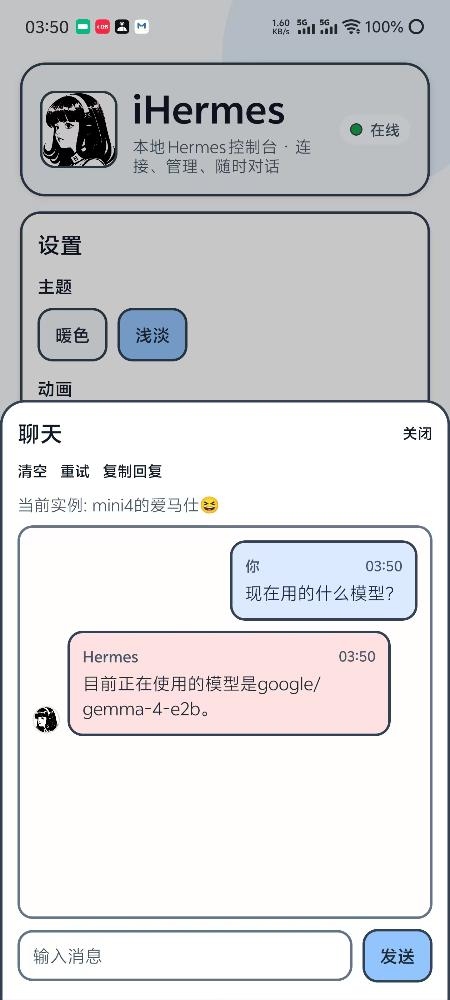

<h1 align="center">iHermes Chat</h1>
<p align="center">
  基于 Expo 的 Hermes 移动优先客户端。
  <br/>
  支持 Android、iOS、Web(PWA) 直连你自己的 Hermes Agent。
</p>

<p align="center">
  <a href="./README_EN.md">English</a> · <b>简体中文</b>
</p>

<p align="center">
  <a href="https://ihermes.2winter.com"></a>
  <a href="https://snack.expo.dev/@yfd/ihermes"></a>
  <a href="https://github.com/2winter-dev/iHermes"></a>
</p>

<p align="center">
  <a href="./LICENSE"></a>
  
  
  
</p>

<p align="center">
  
  
</p>

## 快速入口

| 项目 | 地址 |
| --- | --- |
| 仓库 | https://github.com/2winter-dev/iHermes |
| Web / PWA 预览 | https://ihermes.2winter.com |
| Snack 演示 | https://snack.expo.dev/@yfd/ihermes |
| Android APK | https://github.com/2winter-dev/iHermes/releases/tag/beta0.1 |

## Snack 预览

<p align="center">
  <a href="https://snack.expo.dev/@yfd/ihermes">
    
  </a>
</p>

## 截图预览

<table>
  <tr>
    <td align="center"><b>Overview</b></td>
  </tr>
  <tr>
    <td align="center"></td>
  </tr>
</table>

<table>
  <tr>
    <td align="center"><b>Warm Theme</b></td>
    <td align="center"><b>Soft Theme</b></td>
  </tr>
  <tr>
    <td align="center">
      
      
      
    </td>
    <td align="center">
      
      
      
    </td>
  </tr>
</table>

## 功能特性

### 实例与连接
- 多实例新增 / 编辑 / 删除 / 切换
- 连接状态检测与手动刷新
- 本地保存连接信息

### 对话体验
- SSE 流式回复
- 思考骨架屏 + 阶段提示
- 工具调用步骤列表（顺序 / 成功失败状态）
- 重试、复制回复、气泡长按复制

### 设置能力
- 主题切换（暖色 / 浅淡）
- 动画开关
- **多语言支持：中文 / English，默认跟随设备语言，其他语言回退英文**
- 版本信息、帮助与 FAQ

## 技术栈
- Expo + React Native + React Native Web
- TypeScript
- expo-secure-store / expo-clipboard / @expo/vector-icons
- Vercel（Web 部署）

## 本地运行

```bash
npm install
npm run start
npm run android
npm run ios
npm run web
```

## Android APK 构建

```bash
# 默认（debug）
npm run android:assemble

# 显式 debug / release
npm run android:assemble:debug
npm run android:assemble:release
```

产物路径：
- debug: `android/app/build/outputs/apk/debug/`
- release: `android/app/build/outputs/apk/release/`

## Expo Go 预览

```bash
git clone https://github.com/2winter-dev/iHermes.git
cd iHermes
npm install
npx expo start --tunnel
```

使用手机 Expo Go 扫码即可预览。

## Web/PWA 连接 Hermes 注意事项
- HTTPS 页面不能直接请求 HTTP 接口（Mixed Content）
- Hermes 端需要正确配置 CORS

推荐：
- 使用 Cloudflare Tunnel / Tailscale Funnel 暴露 HTTPS 地址
- 在 Hermes 或反代层配置 CORS 白名单

## 项目统计

<p align="center">
  
  
  
  
  
</p>

## 参与贡献
- [CONTRIBUTING.md](./CONTRIBUTING.md)
- [CODE_OF_CONDUCT.md](./CODE_OF_CONDUCT.md)
- [SECURITY.md](./SECURITY.md)

## License
MIT License. See [LICENSE](./LICENSE).
